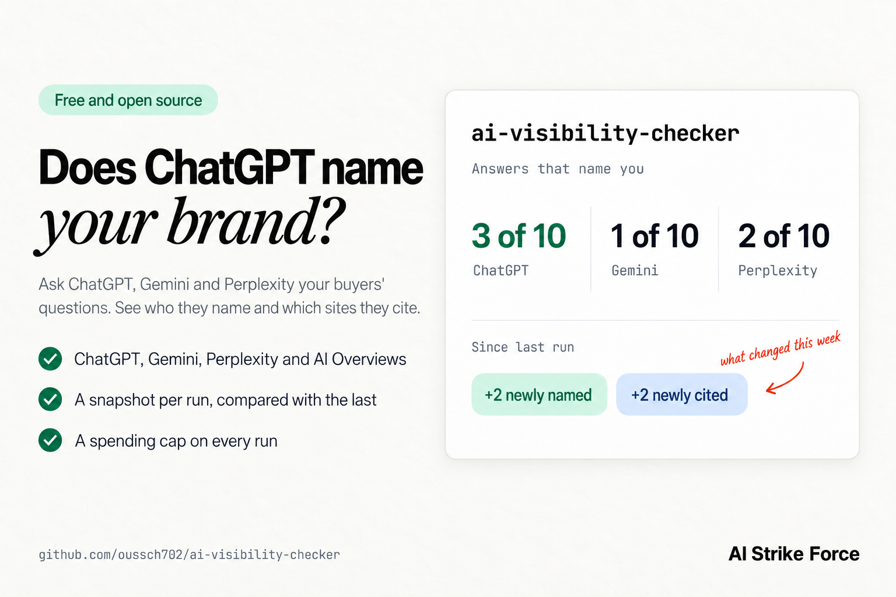

# ai-visibility-checker

[](https://github.com/oussch702/ai-visibility-checker/actions/workflows/test.yml)


[](LICENSE)



Check whether AI answers mention your brand. ai-visibility-checker asks ChatGPT, Gemini and Perplexity the questions your buyers ask, looks at Google's AI Overviews for your keywords, and reports who gets named, which sites get cited, and what changed since the last run.

Your analytics can show a visit that came from ChatGPT, but not what ChatGPT said about you, or about your competitors, before that visit. The only way to know is to ask the same questions again and again and keep every answer. This tool does that through the DataForSEO API.

We first ran this check as a handful of scripts for an auto-parts retailer we work with. We asked ChatGPT, Gemini and Perplexity ten buyer questions: 3 of the 30 answers mentioned the retailer, all three on ChatGPT. On Google, 67 of the result pages we pulled for its searches carried an AI Overview, and 1 of the 67 cited the retailer's site. The answers and the searches together cost $1.17 in API calls. This tool grew out of those scripts, and adds a snapshot per run so the next check shows what moved. The write-up, with the first check's numbers and what a run costs: [Does ChatGPT mention your brand? Ask what your buyers ask, and count the answers](https://aistrikeforce.com/chatgpt-brand-mentions).

## Quick start

```bash
npx github:oussch702/ai-visibility-checker \
  --brand "Example" \
  --domain example.com \
  --prompts prompts.txt
```

`prompts.txt` holds one buyer question per line, written the way a customer would ask it:

```text
What is the best CRM for a small marketing agency?
Which CRM do agencies use to track client projects?
Is there a CRM built for creative agencies?
```

The tool reads your DataForSEO API login and password from the `DATAFORSEO_LOGIN` and `DATAFORSEO_PASSWORD` environment variables, or from a file passed with `--credentials`. Both are on the API Access tab of your DataForSEO dashboard. The API password is not the one you sign in with.

It prints an estimate before it spends anything. Ten questions on the three assistants are estimated at $0.71, and `--max-cost` (default $5) refuses any run estimated above it. Add `--estimate` to see the estimate without running.

## What it does

- **Asks the assistants.** Each question goes to ChatGPT, Gemini and Perplexity through DataForSEO's LLM Responses API, with web search on, so every answer comes with the sources it cites.
- **Reads each answer.** It records whether the answer names you, whether it cites a page on your domain, which of your `--competitor` names it mentions, and which other names it lists.
- **Checks Google.** Each keyword in `--keywords` goes to Google through DataForSEO's SERP API, with the AI Overview loaded even when Google loads it after the page. The tool records whether an overview appears, whether it names you, and whether it cites your domain.
- **Reports and compares.** The share of answers that name and cite you on each engine, the most cited domains, the answers that name a competitor and not you, and what changed since the previous run: newly named, no longer named, newly cited, lost citations.
- **Keeps the spend in check.** An estimate before the run, a limit with `--max-cost`, a cache of the day's raw answers so a second run the same day is free, and a total of what DataForSEO actually charged.

How it decides:

- An answer **names you** when one of your `--brand` names or your domain appears in its text as a whole word, ignoring case and accents. It reads the text a reader sees, so a link address alone does not count.
- An answer **cites you** when one of its sources is on your domain or a subdomain of it. Gemini cites through Google redirect links; the tool uses the original address that DataForSEO returns next to each one.
- **Other names** come from the bold text, list items and headings of each answer, which is where assistants put the companies they recommend. It is a heuristic, so expect the odd heading among them, and use `--competitor` for the names you want counted exactly.

## Example report

A made-up CRM at example.com, one week after its first run:

```text
ai-visibility-checker · example.com · 10 questions on 3 engines, 12 keywords on Google · United States, en

AI answers            named you         cited you
  ChatGPT         3 of 10   30%     2 of 10   20%
  Gemini          1 of 10   10%     0 of 10    0%
  Perplexity      2 of 10   20%     3 of 10   30%
  All engines     6 of 30   20%     5 of 30   17%

Google AI Overviews: shown for 7 of 12 keywords
  named you in 1, cited example.com in 2
    cited: "crm for small agencies"
    cited: "agency project tracking software"

Most cited domains      answers  overviews
  g2.com                     25          7
  reddit.com                 10          7
  capterra.com                5          7
  youtube.com                10          0
  example.com (you)           5          2

Named a competitor and not you: 6
  Gemini "What is the best CRM for a small marketing agency?": Acme
  ChatGPT "Which CRM do agencies use to track client projects?": Globex
  Gemini "Which CRM do agencies use to track client projects?": Globex
  ChatGPT "Which CRM do design studios recommend?": Acme
  Perplexity "What CRM do agencies switch to when they outgrow their first one?": Globex
  Google "crm for agencies": Acme
Other names in lists and bold text: Initech (25), Umbrella (17), Hooli (12), Vandelay (9)

Since 2026-09-18 09:12 UTC
  Newly named: 2   No longer named: 1
  Newly cited: 2   Lost citations: 0
    newly named: Perplexity "What is a good alternative to spreadsheets for tracking agency leads?"
    newly named: ChatGPT "What is the easiest CRM to set up for a small team?"
    no longer named: Gemini "Which CRM do agencies use to track client projects?"
    newly cited: Perplexity "Which CRM handles retainers and project billing?"
    newly cited: Google "agency project tracking software"

Spent $0.57 on 42 calls to DataForSEO (estimated $0.76).

Saved ai-visibility/example.com/2026-09-25T10-02-11Z.json
```

## Options

Run it again a week later and the report adds everything that changed in between. Snapshots are saved under `./ai-visibility/<domain>/`, one JSON file per run, with every answer, its sources and its cost.

| Option | What it does |
| --- | --- |
| `--brand` | Your brand name. Repeat it for other spellings and product names. |
| `--domain` | Your site, such as `example.com`. Subdomains count as yours. Repeat it for several. |
| `--prompts` | A text file with one buyer question per line, up to 500 characters each. Lines starting with `#` are skipped. |
| `--keywords` | A text file with one Google search per line, to check AI Overviews. |
| `--engines` | Any of `chatgpt,gemini,perplexity,google`. Default: the three assistants, plus `google` when `--keywords` is given. |
| `--competitor` | A competitor's name. Repeat it for several. |
| `--location` | A country name, a two-letter country code, or a DataForSEO location name or code. Default `United States`. |
| `--language` | Language of the Google results, as a code (`en`) or a name (`English`). Default `en`. |
| `--model` | The model for one assistant, as `engine=model`, for example `chatgpt=gpt-5`. Defaults: `gpt-5-mini`, `gemini-3.5-flash` and `sonar`. |
| `--max-cost` | The most a run may spend, in US dollars. Default `5`. |
| `--estimate` | Print the cost estimate and stop, without calling DataForSEO. |
| `--credentials` | A file with `DATAFORSEO_LOGIN=` and `DATAFORSEO_PASSWORD=` lines, or JSON with `login` and `password`. Defaults to those environment variables. |
| `--out` | Folder for snapshots and the day's cache. Default `./ai-visibility`. |
| `--concurrency` | Requests in parallel. Default 5. |
| `--json` | Print the snapshot and the changes as JSON instead of the report. |
| `--csv` | Also write a CSV next to each snapshot, one row per answer and per keyword. |
| `--compare a.json b.json` | Compare two saved snapshots without calling DataForSEO. |

## Costs

Each AI answer costs DataForSEO's $0.0006 task fee plus what the model's provider charges for tokens and web searches, which DataForSEO passes on. Each Google keyword costs $0.002 for the results page and $0.002 more to load the AI Overview. The estimate uses these prices, as published on 25 September 2026:

| Engine | Default model | Estimate per request | Made of |
| --- | --- | --- | --- |
| ChatGPT | `gpt-5-mini` | $0.016 | Task fee, one web search call at $0.01, tokens at $0.25 in and $2 out per million |
| Gemini | `gemini-3.5-flash` | $0.047 | Task fee, two Google Search queries at $0.014 each, tokens at $1.50 in and $9 out per million |
| Perplexity | `sonar` | $0.0077 | Task fee, a $0.005 request fee, tokens at $1 per million |
| Google AI Overviews | | $0.004 | $0.002 per results page, $0.002 for the AI Overview |

Sources: [DataForSEO LLM Responses pricing](https://dataforseo.com/pricing/ai-optimization/llm-responses), [DataForSEO SERP API](https://docs.dataforseo.com/v3/serp/google/organic/live/advanced/), [OpenAI](https://developers.openai.com/api/docs/pricing), [Gemini](https://ai.google.dev/gemini-api/docs/pricing), [Perplexity](https://docs.perplexity.ai/getting-started/pricing).

Real costs move with the length of each answer and the number of searches a model runs, so the tool adds up the cost DataForSEO reports for every call. Before each request it checks that the spend so far, plus what the request is expected to cost, stays within `--max-cost`. A request is expected to cost its estimate, or the most a call to the same engine has cost in this run, whichever is higher. A single answer can still cost more than expected, so a run can end slightly above the limit.

Raw answers are cached under `ai-visibility/.cache/<day>/`. Running again the same day, for example with another `--competitor`, costs nothing.

## What it cannot do

- **Promise the same answer twice.** AI answers vary from run to run, even for the same question on the same day. Read the shares across many questions, and compare runs over weeks rather than single answers.
- **See the apps exactly as your buyers do.** The tool asks the models through their APIs, with web search on. The ChatGPT and Gemini apps add memory, personalization and their own choice of model, so a signed-in buyer can get a different answer.
- **Ignore location and language.** Results depend on both. ChatGPT and Perplexity search from the country of `--location`, DataForSEO's Gemini endpoint takes no location, and Google results follow `--location` and `--language`.
- **Tell a brand from a common word.** A brand called Notion or Monday also matches those words in an answer. Pass a longer form, such as `monday.com`, as the `--brand` instead.
- **Run for free.** It needs a DataForSEO account with credit, since every request is paid.

## FAQ

**How do I know if ChatGPT recommends my brand?**
Ask it the questions your buyers ask, with web search on, and count the answers that name you. This tool does that in bulk on ChatGPT, Gemini and Perplexity at once, and keeps every answer so you can compare next month's.

**What is GEO?**
Generative engine optimization: the work of getting your brand named and cited in answers written by AI, such as ChatGPT, Gemini, Perplexity and Google's AI Overviews. AEO, answer engine optimization, means much the same. Both start with knowing where you stand today, which is what this tool reports.

**How do I check if Google's AI Overview cites my website?**
Put your keywords in a file and pass it with `--keywords`. The tool pulls the live Google results for each one, reads the AI Overview when there is one, and lists the sites it cites.

**Why does ChatGPT give a different answer every time?**
The models choose their words with some randomness, and with web search on they can read different pages each time. That is why the tool reports shares across many questions and compares runs, instead of trusting one answer.

**How much does a check cost?**
The tool is free and MIT licensed. DataForSEO charges per request: ten questions on the three assistants are estimated at $0.71, and a Google keyword at $0.004. The [Costs](#costs) section shows what the estimate is made of.

**Can I track competitors?**
Yes. Pass `--competitor` once for each. The report lists every answer that names a competitor and not you, and each snapshot keeps the competitors every answer named.

## Security

The tool talks to `api.dataforseo.com` and nothing else. It never prints your login or password, and neither the snapshots nor the cache hold them: snapshots keep the questions, answers, sources and costs. Keep credentials files out of version control; the `.gitignore` in this repository already ignores the usual names.

## Contributing

Issues and pull requests are welcome. Run `npm test` before sending a change. The tests never call DataForSEO and need no account.

## License

MIT

---

Built by [AI Strike Force](https://aistrikeforce.com), an AI automation agency. We publish the tools and findings that come out of the systems we run.
